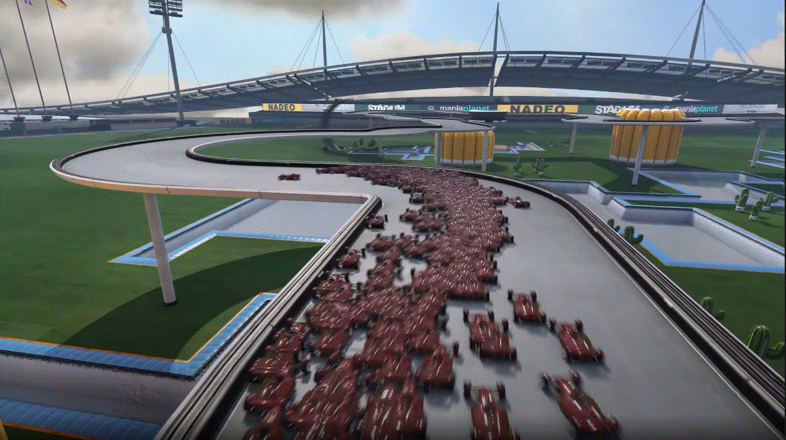

# Recherche State-of-the-art

## Welche Repos / Projekte gibt es zu dem Thema? ##
### Spiele:
- #### [Trackmania](https://github.com/AndrejGobeX/TrackMania_AI)
  

- #### [Tensorkart](https://github.com/kevinhughes27/TensorKart)
  Self-driving MarioKart with TensorFlow and minimal training data
  
- Problematik bei Tensorkart ist der verwendete Emulator Mupen64Plus, bzw. das dafür benötigte, aber mittlerweile veraltete Gym-Interface
- Konnte nach aktuellem auf keinem getestetem Betriebssystem (Mac OS, Windows, Ubuntu) zum laufen gebracht werden

- #### [GTA V](https://github.com/hadipash/AI_GTA5)
  
  Alternativen
  - [Self-Driving-Car-in-Video-Games](https://github.com/ikergarcia1996/Self-Driving-Car-in-Video-Games)

- #### [Euro Truck Simulator 2](https://github.com/aleju/self-driving-truck)
  

- #### Gran Turismo Sport
  [Demo](https://www.youtube.com/watch?v=Zeyv1bN9v4A)
  [Paper](https://rpg.ifi.uzh.ch/docs/RAL21_Fuchs.pdf) `Super-Human Performance in Gran Turismo Sport
Using Deep Reinforcement Learning`

### Andere Projekte:
- ### [Autonomes Einparken](https://github.com/trekhleb/self-parking-car-evolution)
  [Demo im Browser](https://trekhleb.dev/self-parking-car-evolution/#/)

- #### [monokim/PyRacing](https://github.com/monokim/PyRacing)
  A.I. learns how to drive with reinforcement learning
  PyGame + OpenAI GYM [Demonstration](https://www.youtube.com/watch?v=pT2Yzr1RqBo)
  Ergänzende Darstellung auf [YouTube mit Erklärung zu neuronalen Netzen](https://www.youtube.com/watch?v=Cy155O5R1Oo) und [GithubNeuralNine/ai-car-simulation](https://github.com/NeuralNine/ai-car-simulation)
  

- #### [Applying Evolutionary Artificial Neural Networks](https://github.com/ArztSamuel/Applying_EANNs) #### 
  Eine kleine 2D-Simulation in Unity und C#, in der Autos mithilfe eines neuronalen Netzes und evolutionärer Algorithmen lernen, selbständig durch einen Parcours zu manövrieren.
  
  
- #### Unity ML Car Repos
  - [Car Racer with Unity ML-Agents](https://github.com/maxiwoj/car_racer_ml_agents)

    

  - [Autonomous Car Parking using ML-Agents](https://medium.com/xrpractices/autonomous-car-parking-using-ml-agents-d780a366fe46)

    

## Welche Tools / Datensätze gibt es zu dem Thema?
### Simulatoren:
- #### [3D Engine - Unity mit Machine Learning Agents](https://github.com/Unity-Technologies/ml-agents/blob/main/docs/ML-Agents-Overview.md)
- #### [Udacity's Self-Driving Car Simulator](https://github.com/udacity/self-driving-car-sim)
- #### [Microsoft's AirSim](https://github.com/Microsoft/AirSim)
- #### [Autopilot-TensorFlow](https://github.com/SullyChen/Autopilot-TensorFlow)
- #### [openpilot](https://github.com/commaai/openpilot)
- #### [CARLA](http://carla.org)
  
  CARLA has been developed from the ground up to support development, training, and validation of autonomous driving systems. In addition to open-source    code and protocols, CARLA provides open digital assets (urban layouts, buildings, vehicles) that were created for this purpose and can be used freely. The simulation platform supports flexible specification of sensor suites, environmental conditions, full control of all static and dynamic actors, maps generation and much more.

### Andere:
- #### [AWS DeepRacer](https://aws.amazon.com/de/deepracer/)
  Kostenpflichtige Liga zum Trainieren von Fahrzeugen
  
- Open Source [Repository](https://github.com/aws-deepracer) zur Nutzung des DeepRacers unabhängig von AWS
- Offizielle [Anforderungen & Anleitung](https://docs.aws.amazon.com/deepracer/latest/developerguide/deepracer-build-your-track-materials-and-tools.html) zum Bauen einer eigenen, physischen Rennstrecke

- ### M.I.T. [Carmezim/MIT-6.S094](https://github.com/Carmezim/MIT-6.S094)
  Introduction auf [YouTube](https://youtu.be/1L0TKZQcUtA)

- ### [RoboRace](https://roborace.com)
  
  Roborace wird die weltweit erste Rennserie für autonome Elektrofahrzeuge werden.
  Zehn Teams, jedes mit jeweils zwei Fahrzeugen, sollen im Rahmen der Events an einem einstündigen Rennen teilnehmen. Jeder Rennstall soll dazu mit gleichen Rennautos ausgerüstet werden. Die Echtzeitalgorithmen und die künstliche Intelligenz der Fahrzeuge müssen jedoch eigenständig programmiert werden.
  Beim [Goodwood Festival of Speed](https://www.youtube.com/watch?v=QtVbch-02Fs) wurde zudem das Robocar der Öffentlichkeit vorgeführt. Das Fahrzeug absolvierte am 13. Juli 2018 den ersten offiziellen autonomen Lauf im Rahmen der Veranstaltung.
  
