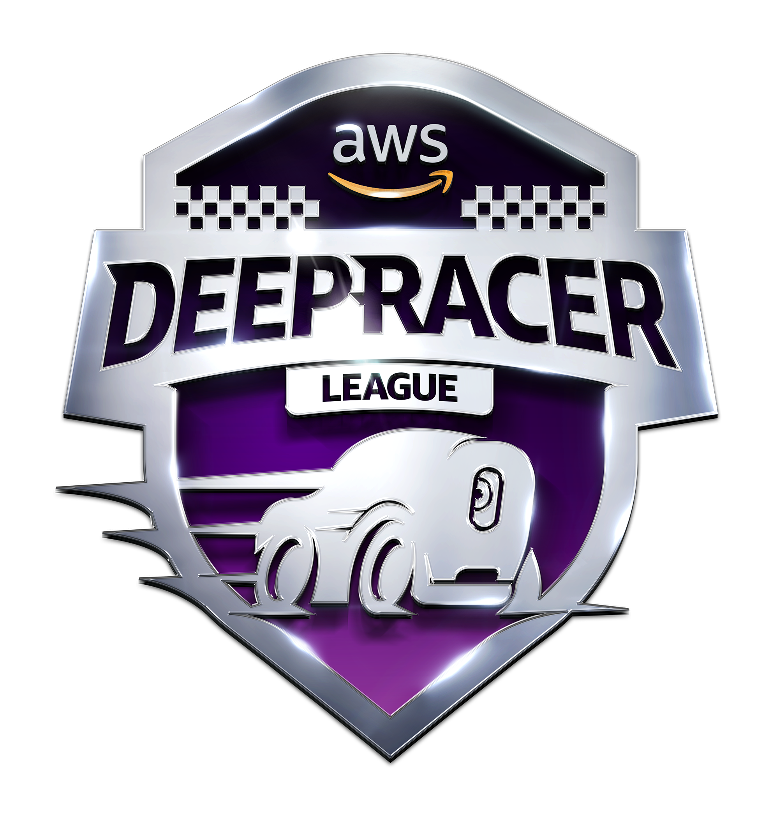
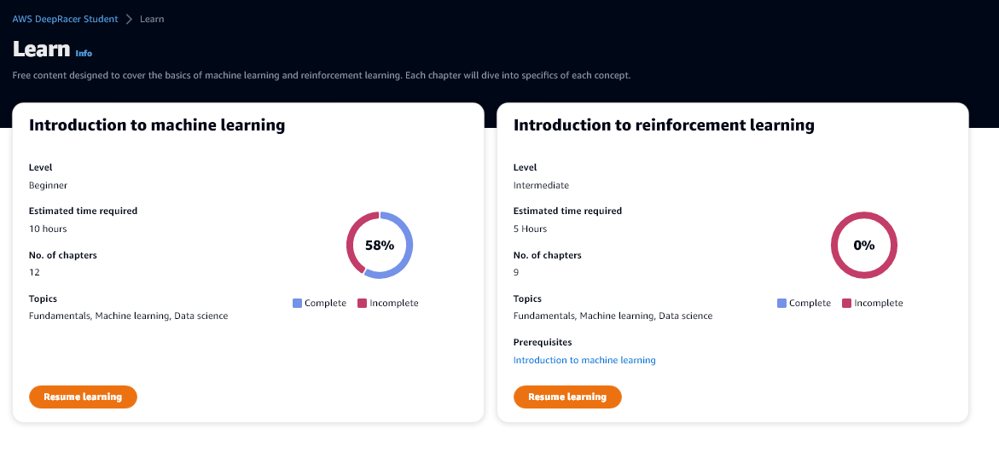
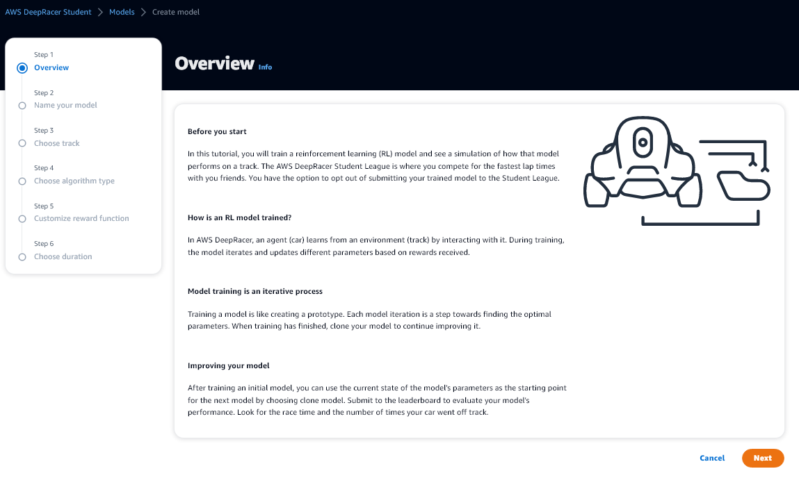
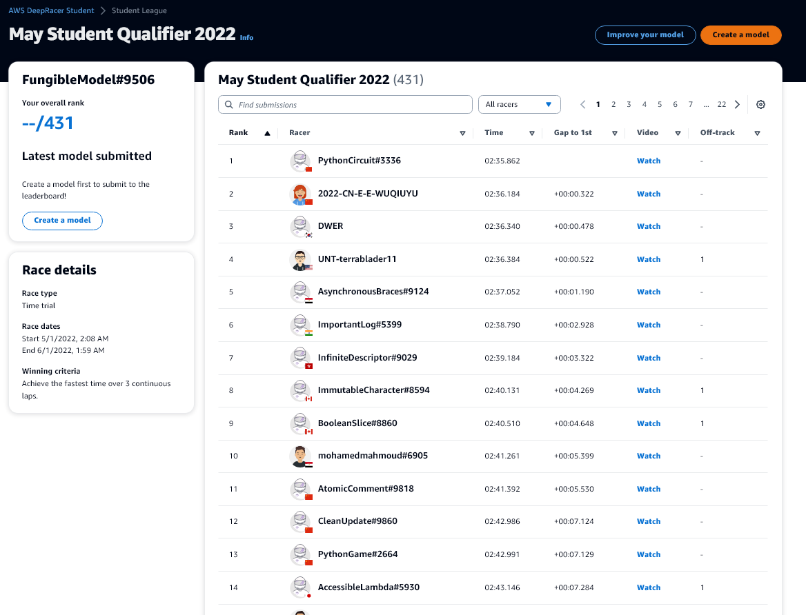

# AWS DeepRacer Student

1. [Links](#links)
2. [Coaching Videos](#coaching)
    1. [Machine Learning](#ml)
    2. [Deep Reinforcement Learning](#drl)
3. [Another paragraph](#paragraph2)
4. [Model Creation](#createmodel)

## Links 

- ### [F.A.Q.](https://docs.aws.amazon.com/deepracer/latest/student-userguide/what-is-deepracer-student-league.html)
- ### [Offizieller Discord-Server](https://discord.com/invite/G72rNQmJRg)
- ### [Homepage](https://aws.amazon.com/de/deepracer/)

## Coaching Videos 

AWS bietet verschiedene Videos in englischer Sprache an zum Selbststudium. Diese sind nicht frei auf YouTube verfügbar.

### Machine Learning

Videos zum allgemeinen Thema "Machine Learning". 
Hier gibt es 12 Kapitel. Die Videos daraus sind fast alle von Udacity.

1. #### Getting started ####
   1. [Introduction to machine learning](https://www.youtube.com/watch?v=Q5N7JGTNBHg)
   2. [What is machine learning?](https://www.youtube.com/watch?v=dZN6Jw_upS0)
   3. [Components of machine learning](https://www.youtube.com/watch?v=w0R0VnImVK8)
2. #### The five steps of machine learning
   1. [Introduction to the five machine learning steps](https://www.youtube.com/watch?v=Q5N7JGTNBHg) 
   2. [Define the problem](https://www.youtube.com/watch?v=DzhnpkXrRV4) 
   3. [Build the dataset](https://www.youtube.com/watch?v=PIlWp3w936s) 
   4. [Model training](https://www.youtube.com/watch?v=7x6fG0bA5q8) 
   5. [Model evaluation](https://www.youtube.com/watch?v=B6_-J44L9gY) 
   6. [Model inference](https://www.youtube.com/watch?v=MfXyh1XaKSc) 
3. #### Examples of machine learning
   1. [House Pricing](https://www.youtube.com/watch?v=CY5PQ0aJ-ig)
   2. [Book Microgenre Exploration](https://www.youtube.com/watch?v=XP4-FOvlxVs)
   3. [Spil Detection from Video with Neural Net](https://www.youtube.com/watch?v=VTmiITFTuEo)

### "Deep Reinforcement Learning 

Videos zum Thema "Deep Reinforcement Learning"

1. #### Getting started
   1. [Machine Learning Refresher](https://www.youtube.com/watch?v=riYohxyHg-k)
   2. Introduction to reinforcement learning
   3. `Reinforcement learning in the real world` **Coming soon!** 
2. #### Reinforcement learning with AWS DeepRacer
   1. Reinforcement learning with AWS DeepRacer 
   2. Training your first AWS DeepRacer model
3. #### Deep dives
   1. Training algorithms 
   2. Reward functions 
   3. `How the AWS DeepRacer device works` **Coming soon!** 
   4. Pro tips from the pros

## Model Creation 

1.Overview
2. Name your model
3. Choose track
4. Choose algorithm type
5. Customize reward function
6. Choose duration

## AWS DeepRacer Student League 

## Eventkalender 

| **Event**                                                      | ** status**   | **Start Date** | **End Date** |
|----------------------------------------------------------------|---------------|----------------|--------------|
| AWS DeepRacer Student League Pre-season competition            | Complete      | 01.12.2021     | 28.02.2022   |
| AWS Deep Racer Student League                                  | Happening now | 01.03.2022     | 30.09.2022   |
| AWS Deep Racer Student League - Finale event                   | Scheduled     | 01.10.2022     | 10/31/2022   |
| AWS AI & ML Scholarship qualification                          | Scheduled     | 11.04.2022     | 30.06.2022   |
| Application Form Open on Udacity website      – Summer Cohort  | Scheduled     | 04.11.2022     | 13.07.2022   |
| AWS AI & ML Scholarship qualification  – Winter Cohort         | Scheduled     | 01.07.2022     | 30.09.2022   |
| Application Form Open on Udacity Website – Winter Cohort       | Scheduled     | 14.07.2022     | 18.10.2022   |

