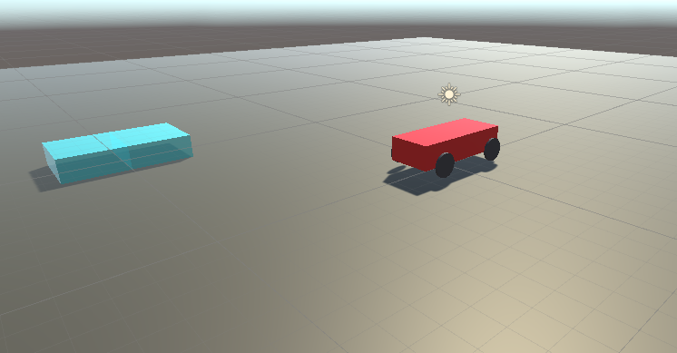
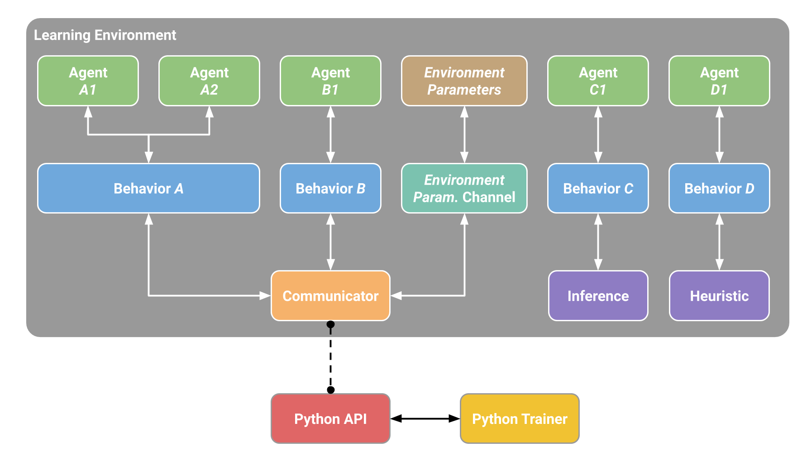
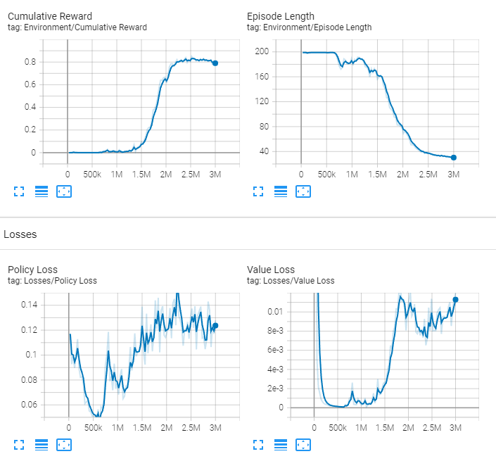
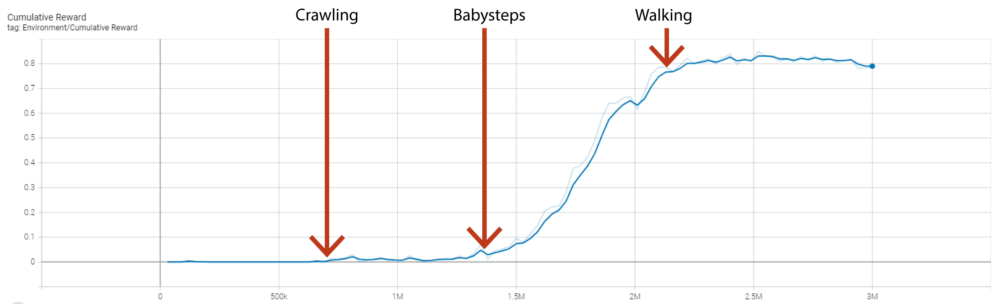

# Unity ML Agents Toolkit


## Software-Setup
| Software | Version |
| ------------- |:-------------:|
| Windows | 10 Pro |
| Unity | 2021.3.1f1 |
| Unity ML Agents Unity Package | 2.0.1 |
| Unity ML Agents Toolkit | Release 19 |
| Python | 3.7.12 |
| Unity ML Agents Python Package | 0.28.0 |
| PyTorch | 1.7.1 |


## Startprojekt


- Das [AuroAI](https://github.com/AuroAi/learning-to-drive) Repository bildet die Testumgebung
- Ziel ist es, dass das Fahrzeug die Blöcke einsammelt, indem es durch diese hindurchfährt (ähnlich wie Snake)
- Das Fahrzeug kann gelenkt (links, rechts) und beschleunigt werden (vorwärts, rückwärts).
- Beim Manövrieren muss sich das Fahrzeug an die Randbedingungen und Physik der Unity Engine halten.


## Einrichtung
### Probleme
- Repository ist 2 Jahre alt
- Paketreferenzen wie Unity ML Agents und PyTorch deshalb auch veraltet
- Deshalb sind viele Features nicht verfügbar

### Lösung
- Update von AuroAI auf aktuelle LTS (Long Term Support) von Unity und verwenden der aktuellsten Unity ML Agent Version (Unity, Python, Toolkit)
- Getätigte Änderungen
  - Umschreiben von Scripts für neue Version von Unity ML Agents
  - Umschreiben YAML für das Toolkit
  
## Unity ML Agents
### Übersicht

<em>Aufbau Learning Environment (<a href="https://github.com/Unity-Technologies/ml-agents/blob/main/docs/ML-Agents-Overview.md" title="Quelle Unity ML Agents Repository">Quelle Unity ML Agents Repository</a>)</em>

### Konfiguration des Unity ML Toolkit ([Config Reference](https://github.com/Unity-Technologies/ml-agents/blob/main/docs/Training-Configuration-File.md))
```yaml
default_settings:
    trainer_type: ppo
    hyperparameters:
      batch_size: 1024
      beta: 5.0e-3
      buffer_size: 10240
      epsilon: 0.2
      num_epoch: 3
      lambd: 0.95
      learning_rate: 3.0e-4
      learning_rate_schedule: linear
    network_settings:
      normalize: false
      hidden_units: 128
      vis_encode_type: simple
      num_layers: 2
      memory:
        sequence_length: 64
        memory_size: 128
      use_recurrent: false
    max_steps: 5.0e5
    time_horizon: 64
    summary_freq: 10000
    reward_signals:
        extrinsic:
            strength: 1.0
            gamma: 0.99
behaviors:
  ReachTarget:
    network_settings:
      normalize: true
      num_layers: 3
      hidden_units: 512
    hyperparameters:
      num_epoch: 3    
      batch_size: 2048
      buffer_size: 20480
    time_horizon: 1000
    max_steps: 3e6
    summary_freq: 30000
    keep_checkpoints: 5
```


### Training
 
<br/>
<hr/>
<br/>
 
<br/>
<hr/>
<br/>
 
<br/>


### Inference (Mit Internal Brain => Onnx-Datei)


## Grenzen und Erweiterungen
### Unity Inference Engine & externes Training ([Doku](https://github.com/Unity-Technologies/ml-agents/blob/main/docs/Unity-Inference-Engine.md))
- Extern trainierte Models werden offiziell nicht unterstützt
- Es ist aber möglich wenn die Input und Output Tensoren angepasst werden
- Grund ist eigene Engine die auf Compute Shader basiert
- Baut auf Pytorch und dem Open Neural Network Exchange Format auf

### Gym Unity Wrapper ([Doku](https://github.com/Unity-Technologies/ml-agents/blob/main/gym-unity/README.md))
- Mit dem Gym Unity Wrapper ist es möglich Unity ML Agents mit den Baseline Algorithmen aus gym zu trainieren (mit Limitationen)
- Zusätzlich unterstützt der Gym Unity Wrapper auch die Google Dopamine Algorithmen (mit Limitationen)


