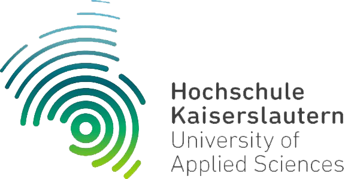

# DL_SS22_T3_DRIVE

## Unity-Environement zum Reinforcement Learning

Während der Projektarbeit wurde mittels der GameEngine [Unity](https://unity.com/) eine Umgebung für interessierte Studierende zum Trainieren von selbstfahrenden Autos auf einer konfigurierbaren Strecke entwickelt. 
Für genaue technische Details gibt es dazu die [technische Dokumentation](./docs/4_Unity_Environement_Documentation.md).

## Blogartikel

- [Titel1](Link1)
- [Titel2](Link2)

## Dokumente zum Projektfortschritt

- [Installation von Gym](./docs/0_Install_Gym.md)
- [Recherche](./docs/0_Research.md)
- [AWS DeepRacer](./docs/1_AWS_DeepRacer.md)
- [Unity ML Agents](./docs/2_Unity_ML_Agents.md)
- [AWS DeepRacer Optimization](./docs/3_AWS_DeepRacer_Optimization.md)

## Studierende

| **Vorname** | **Nachname** | **E-Mail**           |
| ----------- | ------------ | -------------------- |
|Aaron        |Santamaria    |aasa0001@stud.hs-kl.de|
|Alexander    |Opris         |alop0001@stud.hs-kl.de|
|Maximilian   |Kreutz        |makr0050@stud.hs-kl.de|

 
 

    

