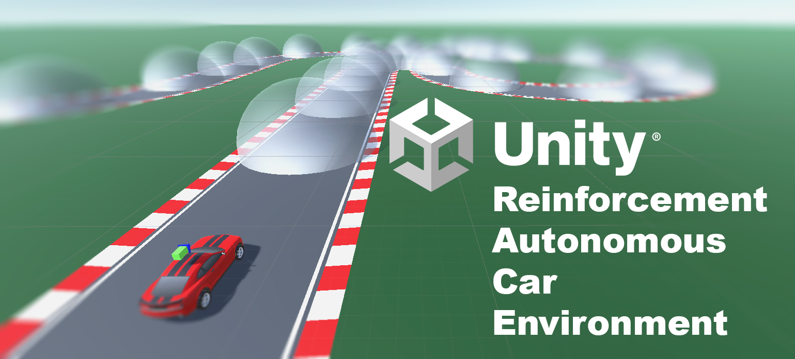

# U Race

 

Während der Projektarbeit wurde mittels der GameEngine [Unity](https://unity.com/) eine Umgebung für interessierte Studierende zum Trainieren von selbstfahrenden Autos auf einer konfigurierbaren Strecke entwickelt. 
Für das Starten des Lernens und genaue technische Details gibt es dazu die [technische Dokumentation](./docs/4_Unity_Environement_Documentation.md).

## Blogartikel

- [U-Race](https://www.youtube.com/watch?v=dQw4w9WgXcQ)
- [AWS-DeepRacer](https://www.youtube.com/watch?v=dQw4w9WgXcQ)

## Dokumente zum Projektfortschritt

- [Installation von Gym](./docs/0_Install_Gym.md)
- [Recherche](./docs/0_Research.md)
- [AWS DeepRacer](./docs/1_AWS_DeepRacer.md)
- [Unity ML Agents](./docs/2_Unity_ML_Agents.md)
- [AWS DeepRacer Optimization](./docs/3_AWS_DeepRacer_Optimization.md)
- [technische Dokumentation zu U-Race](./docs/4_Unity_Environement_Documentation.md)

## Studierende

| **Vorname**  | **Nachname**  | **E-Mail**            |
| ------------ | ------------- | --------------------- |
| Aaron        | Santamaria    | aasa0001@stud.hs-kl.de|
| Alexander    | Opris         | alop0001@stud.hs-kl.de|
| Maximilian   | Kreutz        | makr0050@stud.hs-kl.de|

 
 

    

