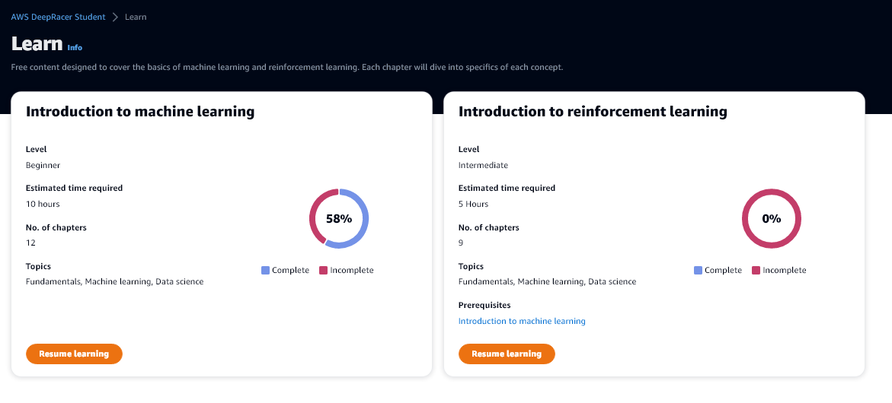

# AWS DeepRacer Student


1. [Links](#links)
2. [Coaching Videos](#coaching)
    1. [Machine Learning](#ml)
    2. [Deep Reinforcement Learning](#drl)
3. [Physiche Rennstrecken](#races)
4. [Model Creation](#createmodel)


## Links <a name="links"></a>

- ### [F.A.Q.](https://docs.aws.amazon.com/deepracer/latest/student-userguide/what-is-deepracer-student-league.html)
- ### [Offizieller Discord-Server](https://discord.com/invite/G72rNQmJRg)
- ### [Homepage](https://aws.amazon.com/de/deepracer/)
- ### [Student League](https://student.deepracer.com)

## Coaching Videos <a name="coaching"></a>

AWS bietet verschiedene Videos in englischer Sprache an zum Selbststudium. Diese sind nicht frei auf YouTube verfügbar.



### Machine Learning<a name="ml"></a>

Videos zum allgemeinen Thema "Machine Learning". 
Hier gibt es 12 Kapitel. Die Videos daraus sind fast alle von `Udacity`.

1. #### Getting started ####
   1. [Introduction to machine learning](https://www.youtube.com/watch?v=Q5N7JGTNBHg)
   2. [What is machine learning?](https://www.youtube.com/watch?v=dZN6Jw_upS0)
   3. [Components of machine learning](https://www.youtube.com/watch?v=w0R0VnImVK8)
2. #### The five steps of machine learning
   1. [Introduction to the five machine learning steps](https://www.youtube.com/watch?v=Q5N7JGTNBHg) 
   2. [Define the problem](https://www.youtube.com/watch?v=DzhnpkXrRV4) 
   3. [Build the dataset](https://www.youtube.com/watch?v=PIlWp3w936s) 
   4. [Model training](https://www.youtube.com/watch?v=7x6fG0bA5q8) 
   5. [Model evaluation](https://www.youtube.com/watch?v=B6_-J44L9gY) 
   6. [Model inference](https://www.youtube.com/watch?v=MfXyh1XaKSc) 
3. #### Examples of machine learning
   1. [House Pricing](https://www.youtube.com/watch?v=CY5PQ0aJ-ig)
   2. [Book Microgenre Exploration](https://www.youtube.com/watch?v=XP4-FOvlxVs)
   3. [Spil Detection from Video with Neural Net](https://www.youtube.com/watch?v=VTmiITFTuEo)

### "Deep Reinforcement Learning <a name="drl"></a>

Diese Videos sind von AWS und spezialisieren sich auf den DeepRacer.

1. #### Getting started
   1. [Machine Learning Refresher](https://www.youtube.com/watch?v=riYohxyHg-k)
   2. [Introduction to reinforcement learning](https://www.youtube.com/watch?v=_pNU0hqFTxw)
   3. `Reinforcement learning in the real world` **Coming soon!** 
2. #### Reinforcement learning with AWS DeepRacer
   1. [Reinforcement learning with AWS DeepRacer](https://www.youtube.com/watch?v=lPo9n_LzYAI)
   2. [Training your first AWS DeepRacer model](https://www.youtube.com/watch?v=pnc0z76bKzA)
3. #### Deep dives
   1. Training algorithms
      1. [Part 1](https://www.youtube.com/watch?v=wtRYcwFeUks)
      2. [Part 2](https://www.youtube.com/watch?v=wtRYcwFeUks)
      3. [Part 3](https://youtu.be/YjSD1el5AQ0)
      4. [Part 4](https://www.youtube.com/watch?v=gKRtfO-r8NI)
   2. Reward functions
      1. [Part 1](https://www.youtube.com/watch?v=ANIRYsZZ4XI)
      2. [Part 2](https://www.youtube.com/watch?v=pov0afxAvlo)
      3. [Part 3](https://www.youtube.com/watch?v=IVZlh_PPHw0)
      4. [Part 4](https://www.youtube.com/watch?v=CDUvW0YVqCc)
   3. `How the AWS DeepRacer device works` **Coming soon!** 
   4. [Pro tips from the pros](https://www.youtube.com/watch?v=KiPVdKESroU)

## Physische Rennstrecken <a name="races"></a>

Für die Nutzung des physischen DeepRacers auf einer Rennstrecke muss man sich sehr genau an die Spezifikationen von AWS halten. 

Der Platzverbrauch dieser Strecken kann zwischen einem Büro und einer Vorlesungssaal schwanken.

Dabei muss Folgendes beachtet werden:
- [Farben](https://docs.aws.amazon.com/deepracer/latest/developerguide/deepracer-track-examples.html)
- [Kurvenradien](https://docs.aws.amazon.com/deepracer/latest/developerguide/deepracer-build-your-track-construction.html)
- Streckenbreite zwischen 53 und 69 cm
- optionale Streckenbarrieren mit 75 cm Höhe und 60 cm Abstand


Es existieren einige, vorgefertigte Strecken. Die jeweilige .PDF kann dann hoch skaliert werden und ausgedruckt werden.

Der kleinste Kurs (kontinuierlicher Kreis) sollte demnach einen Duechmesser von 1,50 bzw. eher 1,80 m haben.


`AWS DeepRacer Championship Cup 2019 Track Template`

Fläche: 10,4 x 8,3 m


`AWS DeepRacer 2022 Summit Speedway Track Template`

Fläche: 5,5 x 12,2 m

[](https://www.youtube.com/watch?v=MaSZfEmqMPs)

### Model Creation <a name="createmodel"></a>


1. Overview
2. Name vergeben
3. Strecke wählen
4. Algorithmus
5. Schreiben der `Reward function`
6. Dauer des Trainings

Die Funktion für den Reward des Agenten wird in Python geschrieben.

Während des Trainings kann man den Agenten im Live-Stream verfolgen.


### Input Parameters

Die Paramter für die Reward-Funcion und ihre Erklärung kann [hier](https://docs.aws.amazon.com/deepracer/latest/developerguide/deepracer-reward-function-input.html) nachgelesen werden.

```python
{
    "all_wheels_on_track": Boolean,        # flag to indicate if the agent is on the track
    "x": float,                            # agent's x-coordinate in meters
    "y": float,                            # agent's y-coordinate in meters
    "closest_objects": [int, int],         # zero-based indices of the two closest objects to the agent's current position of (x, y).
    "closest_waypoints": [int, int],       # indices of the two nearest waypoints.
    "distance_from_center": float,         # distance in meters from the track center 
    "is_crashed": Boolean,                 # Boolean flag to indicate whether the agent has crashed.
    "is_left_of_center": Boolean,          # Flag to indicate if the agent is on the left side to the track center or not. 
    "is_offtrack": Boolean,                # Boolean flag to indicate whether the agent has gone off track.
    "is_reversed": Boolean,                # flag to indicate if the agent is driving clockwise (True) or counter clockwise (False).
    "heading": float,                      # agent's yaw in degrees
    "objects_distance": [float, ],         # list of the objects' distances in meters between 0 and track_length in relation to the starting line.
    "objects_heading": [float, ],          # list of the objects' headings in degrees between -180 and 180.
    "objects_left_of_center": [Boolean, ], # list of Boolean flags indicating whether elements' objects are left of the center (True) or not (False).
    "objects_location": [(float, float),], # list of object locations [(x,y), ...].
    "objects_speed": [float, ],            # list of the objects' speeds in meters per second.
    "progress": float,                     # percentage of track completed
    "speed": float,                        # agent's speed in meters per second (m/s)
    "steering_angle": float,               # agent's steering angle in degrees
    "steps": int,                          # number steps completed
    "track_length": float,                 # track length in meters.
    "track_width": float,                  # width of the track
    "waypoints": [(float, float), ]        # list of (x,y) as milestones along the track center
}
```

### Reward-Functions

#### Erstes eigenes Modell

Eher schhlechte Performance


Platz 645/900

```python
def reward_function(params):
   # Read input parameters
   all_wheels_on_track = params['all_wheels_on_track']
   distance_from_center = params['distance_from_center']
   track_width = params['track_width']
   
   # Give a high reward if no wheels go off the track and
   # the agent is somewhere in between the track borders
   if all_wheels_on_track and (0.5*track_width - distance_from_center) >= 0.05:
      reward = 1.0
   else
      reward = 1e-3
   
   return float(reward)
```

#### Zweites Modell 


Platz 125/1006 -> Platz 184/1256

```python
def reward_function(params):
   # Read input parameters
   track_width = params['track_width']
   distance_from_center = params['distance_from_center']

   # Calculate markers that are at varying distances away from the center line
   marker_0 = 0.05 * track_width
   marker_1 = 0.15 * track_width
   marker_2= 0.30 * track_width
   marker_3 = 0.5 * track_width

   # Give higher reward if the car is closer to center line and vice versa
   if distance_from_center <= marker_0:
      reward =1.0
   elif distance_from_center <= marker_1:
      reward =0.8
   elif distance_from_center <= marker_2:
      reward = 0.42
   elif distance_from_center <= marker_3:
      reward =0.05
   else:
      reward = 1e-5 # likely crashed/ close to off track

   return float(reward)
```

#### Beispiele

Weitere Beispiele für Funktionen sind [hier](https://docs.aws.amazon.com/deepracer/latest/developerguide/deepracer-reward-function-examples.html) verfügbar. Diese umfassen:

- `Follow the Center Line in Time Trials`
- `Stay Inside the Two Borders in Time Trials`
- `Prevent Zig-Zag in Time Trials`
- `Stay in One Lane without Crashing into Stationary Obstacles or Moving Vehicles`

### Advanced

[GitHub](https://github.com/orgs/aws-deepracer/repositories)

[Workshop mit Log-Analyse](https://github.com/aws-samples/aws-deepracer-workshops)
