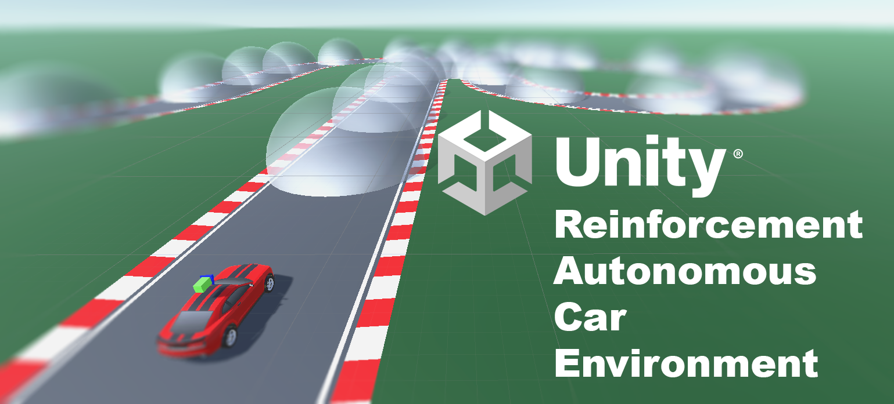
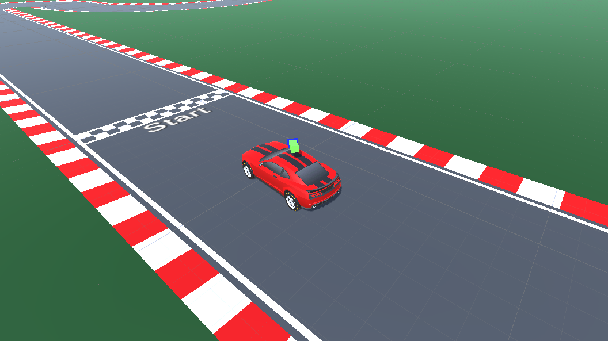
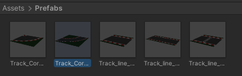
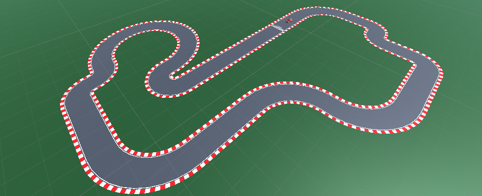
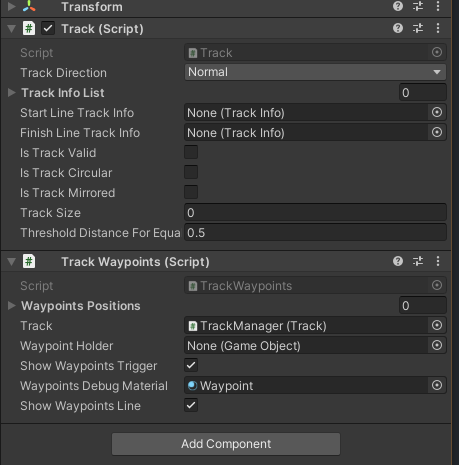
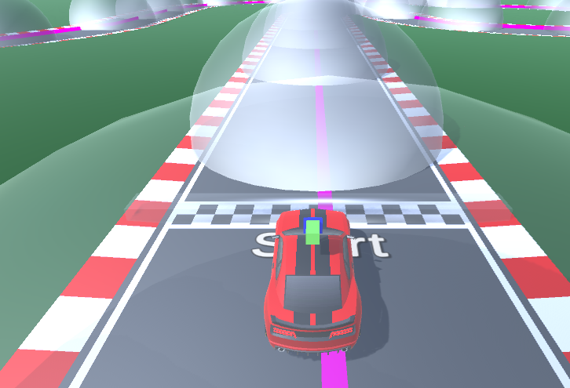
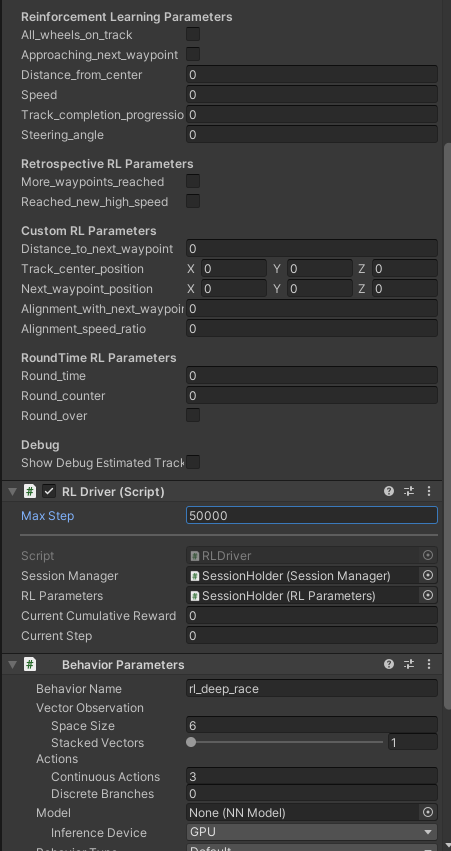
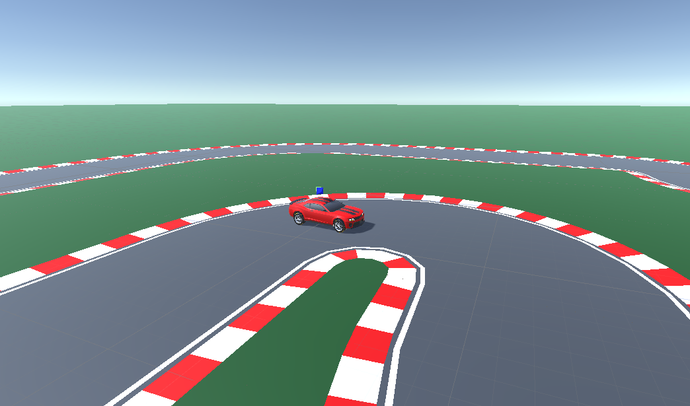

# U Race

 

## Unity Reinforcement Autonomous Car Environment

Innerhalb der Projektzeit wurde ein Environement zum Trainieren von selbstfahrenden Autos mittels des Reinforcement Learnings entwickelt.
Alle Skripte zum Lernen als auch zum eigenständigen Fahren sind in der für *Unity* typischen objektorientierten Programmiersprache *C#* geschrieben.

 

## Benötigte Installation von Software
| Unity | 2021.3.1f1 LTS |
| Python | 3.7+ |
| Unity ML Agents Python Package | 0.28.0 |
| PyTorch | 1.7.1 |

Unity ist kostenlos für Schüler und Studierende ab 16 Jahren. Dazu muss man sich mit der Studentenmail und SheerID [registrieren](https://store.unity.com/de/#plans-individual).

Python kann unter [python.org](https://www.python.org/downloads/release/python-370/) herutnergeladen werden.

```C#
python -m pip install --upgrade pip
pip install pytorch==1.7
pip install mlagents==0.28.0
```

Alternativ kann PyTorch auf der [offiziellen Website](https://pytorch.org/) heruntergeladen werden.

## Abhängigkeiten des Projektes
Diese sollten vom *Unity Package Manager* richtig eingetragen werden und entsprechende Pakete installiert werden.
```JSON
{
  "dependencies": {
    "com.unity.burst": "1.8.0-pre.1",
    "com.unity.collab-proxy": "1.15.18",
    "com.unity.collections": "1.2.3",
    "com.unity.ide.rider": "3.0.14",
    "com.unity.ide.visualstudio": "2.0.15",
    "com.unity.ide.vscode": "1.2.5",
    "com.unity.jobs": "0.50.0-preview.9",
    "com.unity.ml-agents": "2.0.1",
    "com.unity.test-framework": "1.1.31",
    "com.unity.textmeshpro": "3.0.6",
    "com.unity.timeline": "1.6.4",
    "com.unity.ugui": "1.0.0",
    "com.unity.visualscripting": "1.7.8",
    "com.unity.modules.ai": "1.0.0",
    "com.unity.modules.androidjni": "1.0.0",
    "com.unity.modules.animation": "1.0.0",
    "com.unity.modules.assetbundle": "1.0.0",
    "com.unity.modules.audio": "1.0.0",
    "com.unity.modules.cloth": "1.0.0",
    "com.unity.modules.director": "1.0.0",
    "com.unity.modules.imageconversion": "1.0.0",
    "com.unity.modules.imgui": "1.0.0",
    "com.unity.modules.jsonserialize": "1.0.0",
    "com.unity.modules.particlesystem": "1.0.0",
    "com.unity.modules.physics": "1.0.0",
    "com.unity.modules.physics2d": "1.0.0",
    "com.unity.modules.screencapture": "1.0.0",
    "com.unity.modules.terrain": "1.0.0",
    "com.unity.modules.terrainphysics": "1.0.0",
    "com.unity.modules.tilemap": "1.0.0",
    "com.unity.modules.ui": "1.0.0",
    "com.unity.modules.uielements": "1.0.0",
    "com.unity.modules.umbra": "1.0.0",
    "com.unity.modules.unityanalytics": "1.0.0",
    "com.unity.modules.unitywebrequest": "1.0.0",
    "com.unity.modules.unitywebrequestassetbundle": "1.0.0",
    "com.unity.modules.unitywebrequestaudio": "1.0.0",
    "com.unity.modules.unitywebrequesttexture": "1.0.0",
    "com.unity.modules.unitywebrequestwww": "1.0.0",
    "com.unity.modules.vehicles": "1.0.0",
    "com.unity.modules.video": "1.0.0",
    "com.unity.modules.vr": "1.0.0",
    "com.unity.modules.wind": "1.0.0",
    "com.unity.modules.xr": "1.0.0"
  }
}
```

Die Strecke kann unter Verwendung der vorgefertigten Streckenteile indiviudell zusammengebaut werden.
Dabei sind auch Strecken mit getrenntem Start und Ziel möglich. 


 

Wir haben uns für folgende Konfiguration entschieden:

 

## Config.yaml zur Konfiguration 
Vergleiche mit ([offiziellem Repository](https://github.com/Unity-Technologies/ml-agents/blob/main/docs/Training-Configuration-File.md))

```yaml
default_settings:
    trainer_type: ppo
    hyperparameters:
      batch_size: 2048
      beta: 5.0e-3
      buffer_size: 20480
      epsilon: 0.2
      num_epoch: 10000
      lambd: 0.90
      learning_rate: 3.0e-4
      learning_rate_schedule: linear
    network_settings:
      normalize: false
      hidden_units: 128
      vis_encode_type: simple
      num_layers: 2
      memory:
        sequence_length: 64
        memory_size: 128
      use_recurrent: false
    max_steps: 5.0e5
    time_horizon: 64
    summary_freq: 1000
    reward_signals:
        extrinsic:
            strength: 1.0
            gamma: 0.99

behaviors:
  rl_deep_race:
    network_settings:
      normalize: true
      num_layers: 3
      hidden_units: 512
    hyperparameters:
      batch_size: 2048
      buffer_size: 20480
    time_horizon: 1000
    max_steps: 2e6
    summary_freq: 3000
    keep_checkpoints: 5
```

### TrackManager

Falls man im Dateibaum den SessionHolder ausklappt, so kann man dann den ```TrackManager.cs``` öffnen.

 

Dieser enthält zahlreiche Informationen zum Status der gebauten Strecke.
Interessant sind die letzten beiden Checkboxen:
- ```show Waypoints Trigger``` und
- ```Show Waypoints Line```

Die ermöglichen das Anzeigen der Waypoints und der Linie, die diese miteinander verbindet.

 

### Rewardfunction im RLDriver
*RLDriver.cs*

In dieser Methode können zu beobachtende Parameter nach außen angegeben werden.

```C#
public override void CollectObservations(VectorSensor sensor){
  // sensor.AddObservation(rLParameters.steering_angle);
}
```

In der ```RewardFunction``` kann man die Methodik zur Evaluation festlegen.
Durch die WayPoints bietet es sich beispielsweise an, einen hohen Reward beim Durchfahren oder in der Nähe des nächsten Waypoints zu geben. 
Mit einer kleinen Strafe für jeden Step sowie eine große für das Verlassen der Strecke wird sich das Netz mit dem Auto schnell in Richtung der ersten Wegpunkte bewegen.

```C#
private void RewardFunction(){
  if (rLParameters.all_wheels_on_track == false || distance_to_next_waypoint > 20f){
    AddReward(-1.0f);
    return;
  }

  if (rLParameters.waypoint_passed){
    AddReward(1.0f);
    return;
  }

  AddReward(-0.001f);
}
```


Durch Vererbung kann man auf einge nützliche Methoden der Klasse ```Agent``` aus dem ```MLAgents-Package```  zurückgreifen:
```C#
AddReward(1.0f);       // Award wird aufaddiert. Sollte immer zwischen -1 und 1 sein.
SetReward(1.0f);       // Award wird festgelegt. Sollte immer zwischen -1 und 1 sein.
EndEpisode();          // Startet den nächsten Durchlauf.
```


Dabei ist Einiges zu beachten:
- Parameter, die in der Reward-Function genutzt werden, sollten auch Teil der Observationen sein.
- Werte sollten niemals größer als der Betrag von 1 sein.
- Die Methode wird bei jedem Step aufgerufen.
- Positives als auch negatives Verhalten muss bewertet und dem Agenten mitgeteilt werden.
- Man muss auch kleine Erfolge (Distanz zum Waypoint verkleinert sich) loben.
- Bei Aufrufen von EndEpisode muss auch der Reward negativ sein, falls man beispielsweise das Verlassen der Strecke mit dem Start der nächsten Runde verbindet.


### Parameter für das Reinforcement Learning
*RLParameters.cs*
Die Attribute dieser Klasse sind alle zum Abruf in RewardFunctions der Agenten abrufbar.
Diese können genutzt werden, um eigene, neue Werte zu berechnen.

```C#
public bool all_wheels_on_track;
public bool approaching_next_waypoint;
public bool waypoint_passed;
public bool more_waypoints_reached;
public bool reached_new_high_speed;
public bool round_over;

public float distance_from_center;
public float speed;
public float track_completion_progression;
public float steering_angle;
public float distance_to_next_waypoint;
public float alignment_with_next_waypoint;
public float alignment_speed_ratio;
public float round_time;

public Vector3 track_center_position;
public Vector3 next_waypoint_position;

public int round_counter;
```

Zum bessere Verständnis fährt man am Besten die Strecke manuell ab und beobachtet dabei die Werte im Detail.
Nachfolgend sind die wichtigsten Parameter kurz erklärt:

| **Name**                     | **Typ**  | **Beschreibung**                                                                                                                                      |
| ---------------------------- | -------- | ----------------------------------------------------------------------------------------------------------------------------------------------------- |
| all_wheels_on_track          | Boolean  | Sind alle vier Räder im Bereich der erlaubten Fahrstrecke.                                                                                            |
| waypoint_passed              | Boolean  | Immer ```false```, wird beim Durchfahren des nächsten Waypoints kurzzeitg ````true```.                                                                |
| distance_from_center         | Float    | Gibt den Betrag in m der Distanz zur Mittellinie an.                                                                                                  |
| speed                        | Float    | Gibt die aktuelle Geschwindigkeit an. Dabei ist zu beachten, dass bei Annäherung zum nächsten Punkt der Wert positiv, bei Distanzierung negativ ist.  |
| track_completion_progression | Float    | Gibt im Bereich 0 bis 1 an, wie viele Wegepunkte schon eingesammelt wurden. Bei voller Runde erhöht sich der RoundCounter.                            |
| distance_to_next_waypoint    | Float    | Bezeichnet die Distanz in m zum nächsten, zu sammelnden Wegepunkt an.                                                                                 |

### SessionHolder
*SessionHolder.cs*

Klappt man diese Datei im Inspector aus, so sieht man alle relevanten Informationen zu:
- ```RLParameters.cs```,
- ```TrackManager.cs```,
- ```RLDriver.cs``` und
- den ```Behaviour Parameters```

 

Der ```Behaviour Name``` sollte stets gleich bleiben.
Die ```SpaceSize``` sollte stets mit der Anzhal der Beobachtungen im ```RLDriver.cs``` gleich sein. 
Sollte dies nicht der Fall sein, erscheint in der Konsole eine entsprechende Warnung.

Wichtig ist auch der ```Max Step```. Dieser sollte gerade am Anfang nicht zu groß gewält werden.

Falls trainierte Modelle verfügbar sind, können diese ausgewählt werden.
Zum Nutzen des Modells sollte der ```Behaviour Type``` auf ```Interference Only``` stehen. 
Mit dem ```Heuristic Mode``` wird das manuelle Steuern mit den Tasten WASD oder den Pfeiltasten ermöglicht.


### Training

Um das Training zu starten, öffnet man ein Terminal und navigiert zur Ordner des Projektes

Dort angekommen gibt man folgende Kommandos zum Start des Trainings an. 
Die ```rl_deep_race_config.yaml``` ist unter ```/Assets/Library``` verfügbar.

Der Trainingsprozess wird mit folgendem Kommando ertmalig gestartet:
```mlagents-learn [relativer Pfad zur Config.yaml] --run-id=[ID]```

Eine Fortsetzung des Trainings kann mit einer bereits existierenden ID und dem Zusatz ```--resume``` erreicht werden.
Mit dem Zusatz ```--force`` kann ein Überschreiben erzwungen werden.

Während des Trainings bekommt man in gewissen Intervallen Rückmeldung, je nach eingestelltem Wert unter der summary_freq, zum aktuell verlaufenden Training.
```yaml
[INFO] rl_deep_race. Step: 240000. Time Elapsed: 377.744 s. Mean Reward: -0.140. Std of Reward: 1.574. Training.
[INFO] rl_deep_race. Step: 270000. Time Elapsed: 143.063 s. Mean Reward: -1.750. Std of Reward: 1.639. Training.
[INFO] rl_deep_race. Step: 300000. Time Elapsed: 402.100 s. Mean Reward: -0.667. Std of -Reward: 2.008. Training.
[INFO] rl_deep_race. Step: 330000. Time Elapsed: 121.917 s. Mean Reward: 0.600. Std of Reward: 1.855. Training.
[INFO] rl_deep_race. Step: 360000. Time Elapsed: 470.298 s. Mean Reward: 1.134. Std of Reward: 1.477. Training.
```

```tensorboard --logdir results``` kann man sich das TensorBoard und den Verlauf über die Zeit anzeigen lassen.

 

Nach Abschluss des Trainings findet sich das NN in einem Ordner namens ```/results```in einer  ```[ID].onsx```-Datei. 
Diese kopiert man in das Projekt und muss dann im SessionHolder dieses Datei als Model auswählen.


 

## Über die Technik ([Doku](https://github.com/Unity-Technologies/ml-agents/blob/main/docs/Unity-Inference-Engine.md))

- Extern trainierte Models werden offiziell nicht unterstützt
- Externe Trainer über Python Low-Level API andockbar 
- Tensorflow wurde von PyTorch seit [Release 13](https://github.com/Unity-Technologies/ml-agents/releases/tag/release_13) als Trainer abgelöst, da es keine native C# Unterstützung bietet
- Es ist aber möglich wenn die Input und Output Tensoren angepasst werden
- Grund ist eigene Engine die auf Compute Shader basiert
- Baut auf Pytorch und dem Open Neural Network Exchange Format auf

</p>
<br>
<br>
<p align="center" width="100%">
    <a href="https://www.hs-kl.de/">
        
    </a>
</p>

